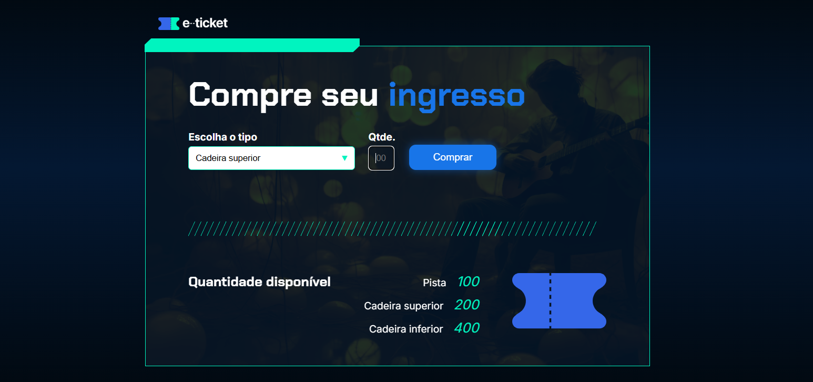

# 🎟️ e-Ticket

Este projeto é um sistema simples de compra de ingressos. Você pode selecionar o tipo de ingresso e a quantidade desejada. 

## 🚀 Funcionalidades

- Escolha do tipo de ingresso: `Cadeira inferior`, `Cadeira superior` ou `Pista`.
- Validação da quantidade de ingressos.
- Verificação de disponibilidade dos ingressos.
- Atualização da quantidade disponível após a compra.

## 🛠️ Como usar

1. Abra o arquivo `index.html` em seu navegador.
2. Escolha o tipo de ingresso e a quantidade desejada.
3. Clique em "Comprar" para finalizar a compra.

## 📸 Imagem do Programa

